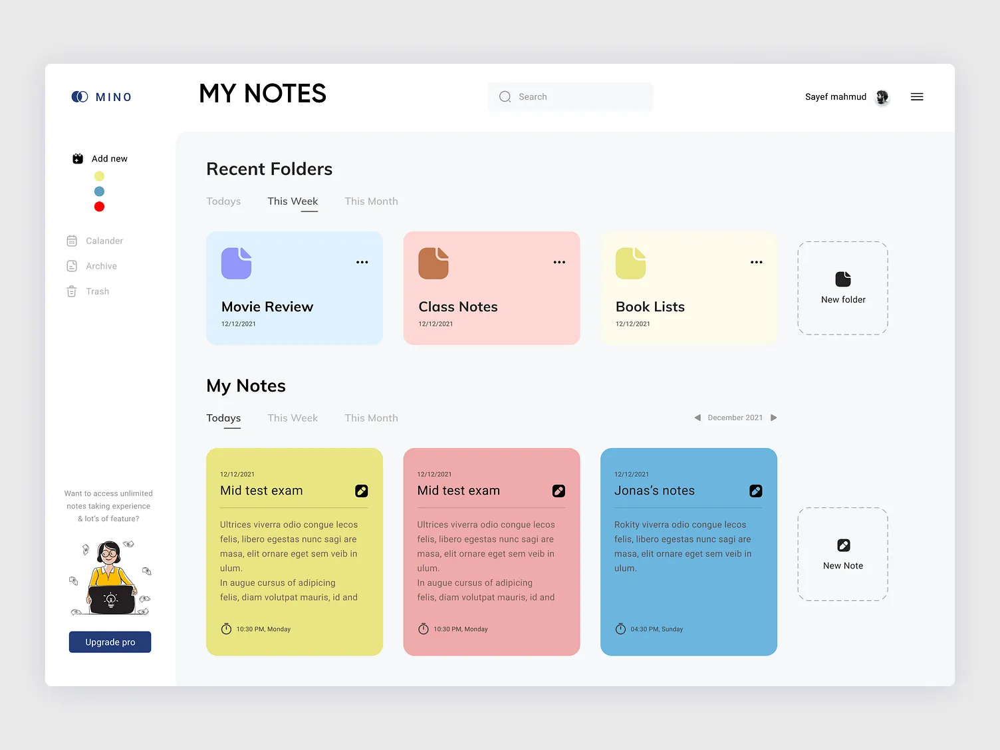

Claro! Abaixo está um exemplo de um README completo baseado na interface exibida na imagem, que aparenta ser de uma aplicação web de anotações chamada "My Notes".

---

# 📘 My Notes – Web App

**My Notes** é uma aplicação web elegante e funcional para criação, organização e gerenciamento de anotações. Com uma interface moderna e intuitiva, o usuário pode criar pastas, visualizar notas por período e manter tudo bem categorizado para fácil acesso.



---

## ✨ Funcionalidades

* 📁 **Organização por Pastas**
  Crie, visualize e organize notas dentro de pastas personalizadas.

* 🕒 **Filtros por Período**
  Navegue por notas e pastas criadas **Hoje**, **Nesta Semana** ou **Neste Mês**.

* 📝 **Editor de Notas**
  Crie novas notas rapidamente e edite conteúdos já salvos com facilidade.

* 🎨 **Notas com Cores**
  Diferencie notas com cores distintas para melhor organização visual.

* 📅 **Calendário Integrado**
  Planeje anotações com base em datas diretamente do menu lateral.

* 🗑️ **Arquivamento e Lixeira**
  Mantenha seu espaço limpo arquivando ou excluindo notas desnecessárias.

* 🔍 **Busca Inteligente**
  Pesquise por notas ou pastas rapidamente com a barra de busca.

* 👤 **Gerenciamento de Usuário**
  Login com perfil e opções de upgrade para acesso premium.

---

## 🖥️ Tecnologias Utilizadas

* **Frontend:**

  * HTML5
  * CSS3 (com design baseado em cartões coloridos)
  * JavaScript (React ou Vue sugerido)

* **Backend (sugestão):**

  * Node.js + Express ou Firebase

* **Banco de Dados (sugestão):**

  * MongoDB, Firestore ou PostgreSQL

* **Autenticação:**

  * JWT ou Firebase Auth

---

## 🚀 Como Rodar o Projeto Localmente

```bash
# Clone o repositório
git clone https://github.com/seuusuario/my-notes-app.git

# Acesse o diretório
cd my-notes-app

# Instale as dependências
npm install

# Rode o app
npm start
```

---

## 📂 Estrutura de Pastas Sugerida

```
my-notes-app/
├── public/
├── src/
│   ├── components/
│   │   ├── FolderCard.jsx
│   │   ├── NoteCard.jsx
│   │   └── Sidebar.jsx
│   ├── pages/
│   │   └── Dashboard.jsx
│   ├── styles/
│   │   └── main.css
│   ├── App.js
│   └── index.js
├── .gitignore
├── package.json
└── README.md
```

---

## 💡 Melhorias Futuras

* ✅ Sincronização em tempo real
* ✅ Integração com Google Calendar
* ✅ Suporte a Markdown nas anotações
* ✅ Upload de imagens e arquivos
* ✅ Modo escuro

---

## 📸 Créditos do Design

Design criado por **Sayef Mahmud** (visível no canto superior direito da imagem).

---

## 📃 Licença

Este projeto é licenciado sob a [MIT License](LICENSE).

---

Quer que eu gere esse projeto base para você em React, Next.js ou outra stack?

